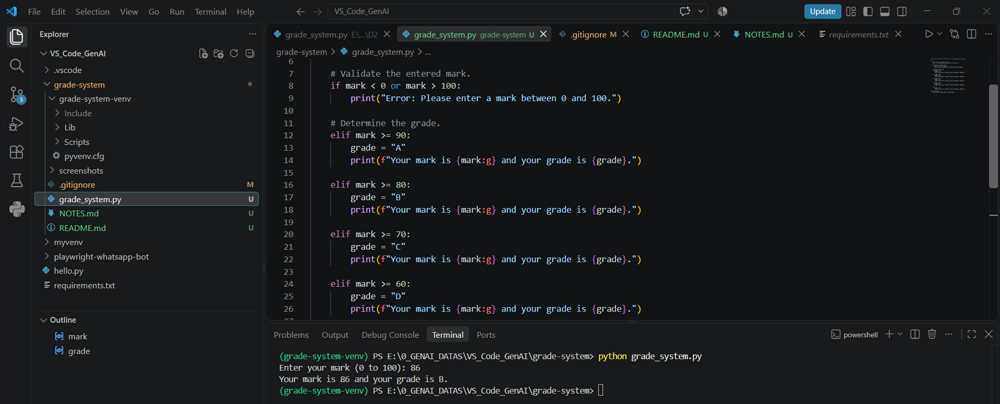

# Student Grade System

A simple Python program that accepts a mark between 0 and 100 and displays the corresponding letter grade.

## Project Objective

The objective of this project is to practise fundamental Python concepts by building a terminal-based grade calculator.

## Grading Scale

| Mark Range | Grade |
| ---------- | ----- |
| 90–100     | A     |
| 80–89      | B     |
| 70–79      | C     |
| 60–69      | D     |
| Below 60   | E     |

## Features

* Accepts a mark from the user
* Supports marks between 0 and 100
* Calculates the corresponding letter grade
* Rejects marks outside the allowed range
* Handles invalid text input without crashing
* Displays the entered mark and final grade

## Technologies Used

* Python 3
* Visual Studio Code
* Git
* GitHub

## Project Structure

```text
grade-system/
├── grade_system.py
├── README.md
├── NOTES.md
├── .gitignore
└── screenshots/
    └── grade-system-output.png
```

## How to Run the Program

1. Download or clone this repository.
2. Open the project folder in Visual Studio Code.
3. Open the terminal.
4. Run the following command:

```bash
python grade_system.py
```

5. Enter a mark between 0 and 100.

## Example Output

```text
Enter your mark (0 to 100): 85
Your mark is 85 and your grade is B.
```

## Output Screenshot



## Test Cases

|      Input | Expected Result |
| ---------: | --------------- |
|        100 | Grade A         |
|         90 | Grade A         |
|         80 | Grade B         |
|         70 | Grade C         |
|         60 | Grade D         |
|         45 | Grade E         |
|        105 | Error message   |
| Text input | Error message   |

## Learning Outcomes

Through this project, I practised:

* Getting input from a user
* Converting input into a number
* Using `if`, `elif`, and `else`
* Validating a numerical range
* Handling errors with `try` and `except`
* Using formatted output
* Managing a project with Git and GitHub

## Author

Sarath Kumar AS
